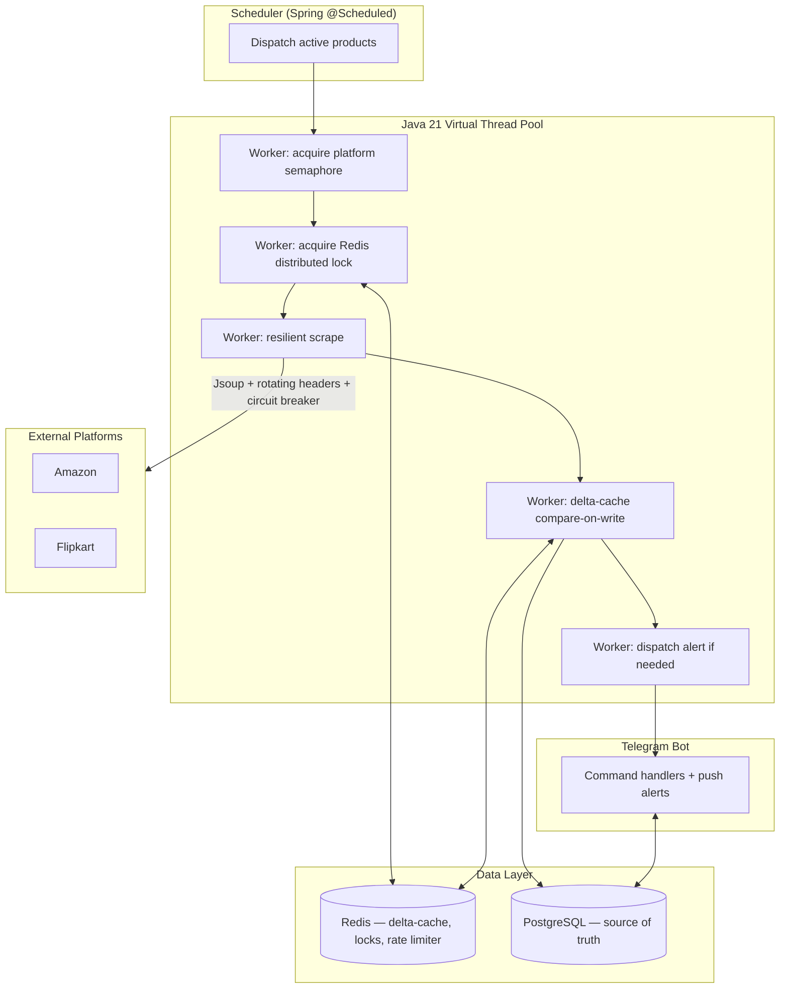

# PricePulse ⚡

An automated e-commerce price monitoring and alert engine built to explore distributed caching, concurrency, and resilience patterns in a real-world backend system — not just another scraper bot.

Tracks product prices and stock across Amazon and Flipkart, avoids redundant database writes via a Redis delta-cache, and pushes instant alerts through a Telegram bot whenever a tracked product's price drops or hits a target threshold.

[](https://openjdk.org/projects/jdk/21/)
[](https://spring.io/projects/spring-boot)
[](https://www.postgresql.org/)
[](https://redis.io/)
[](https://resilience4j.readme.io/)
[](https://core.telegram.org/bots/api)
[-success.svg)]()

---

## Why this project exists

Most "price tracker" projects are a scraper wrapped around a database. PricePulse is built around a different question: **how do you poll hundreds of external, unreliable, rate-limited sources on a schedule without hammering your database, tripping anti-bot defenses, or corrupting state under concurrent access?**

Every core module here exists to answer a specific piece of that problem — not to add a checkbox feature.

---

## Architecture



---

## Key engineering decisions

| Component | What it does | Why it matters |
| :--- | :--- | :--- |
| **Redis delta-cache** | Compares scraped price against cached state; writes to PostgreSQL only on genuine change | Avoided ~86% of redundant DB writes in automated test benchmarks (1,000 simulated cycles, embedded Redis) — see [Metrics](#metrics--observability) |
| **SETNX distributed lock** | Redis `SETNX` with an atomic Lua release script (token-checked, not a blind `DEL`) | Prevents two workers from double-processing the same product under concurrent scrape triggers |
| **Per-platform circuit breakers (Resilience4j)** | Trips to `OPEN` after 50% failure rate over a 10-request window, fast-fails for 60s, then probes via `HALF-OPEN` | One platform's outage never cascades to another; avoids wasting threads retrying a dead endpoint |
| **Full-jitter exponential backoff** | $\text{random}(\text{base} \times 2^{\text{attempt}} / 2, \text{base} \times 2^{\text{attempt}})$ on retry, plus 1–3s jitter before every request | Decorrelates retry timing across workers — avoids the "thundering herd" spike that plain exponential backoff causes |
| **Java 21 virtual threads** | `Executors.newVirtualThreadPerTaskExecutor()` for the scrape worker pool | I/O-bound scraping (blocked ~98% of the time on network waits) is far cheaper on virtual threads than platform threads — no 1MB-per-thread stack cost, no thread-pool queuing bottleneck |
| **Per-platform Semaphore** | Caps in-flight concurrent requests per platform (e.g. 3 for Amazon) | Prevents virtual threads from being too effective — without this, thousands of concurrent scrapes would trigger anti-bot defenses instantly |
| **Distributed sliding-window rate limiter** | Redis sorted set + atomic Lua script (`ZREMRANGEBYSCORE` &rarr; `ZCARD` &rarr; `ZADD`) enforcing $N$ requests per rolling 60s window per platform | Mathematically eliminates the "burst at the window boundary" flaw of fixed-window counters; throttled tasks are skipped and deferred to the next cycle rather than waiting in-place, to avoid reintroducing a thundering herd |
| **ReentrantLock over synchronized** | Audited to zero `synchronized` blocks in concurrent code paths | `synchronized` pins a virtual thread to its carrier thread on blocking I/O, negating the entire benefit of Project Loom |

---

## Tech stack

- **Language / Runtime:** Java 21 (LTS)
- **Framework:** Spring Boot 3
- **Persistence:** PostgreSQL + Spring Data JPA, Flyway migrations
- **Caching / Coordination:** Redis (delta-cache, distributed locks, rate limiter)
- **Scraping:** Jsoup
- **Resilience:** Resilience4j (circuit breakers)
- **Messaging:** Telegram Bot API
- **Observability:** Micrometer + Spring Actuator (custom `/actuator/pricepulse` dashboard)
- **Testing:** JUnit 5, WireMock (HTTP mocking), embedded Redis (`jedis-mock`)

---

## Bot commands

| Command | Description |
| :--- | :--- |
| `/start` | Onboarding message and command overview |
| `/track <url> [target_price]` | Validates the URL, scrapes initial product data, creates the subscription, seeds the cache |
| `/untrack <product_id>` | Deactivates a subscription |
| `/list` | Shows all tracked products with current price, stock, and target |
| `/status` | Live system health: scrape counts, write-avoidance rate, circuit breaker states |

---

## Database schema

- `users` — Telegram identity (chat ID, username)
- `products` — URL, platform, title, current price, stock status
- `user_product_subscriptions` — links users to tracked products with a target price
- `price_history` — append-only time-series log of every committed price snapshot, indexed on `(product_id, recorded_at DESC)` for fast trend queries

---

## Running locally

### 1. Start Postgres and Redis
```bash
docker run --name pricepulse-postgres \
  -e POSTGRES_DB=pricepulse \
  -e POSTGRES_USER=pricepulse \
  -e POSTGRES_PASSWORD=devpassword \
  -p 5432:5432 -d postgres:16

docker run --name pricepulse-redis -p 6379:6379 -d redis:7
```

### 2. Set environment variables

#### Linux / macOS (Bash)
```bash
export DB_URL="jdbc:postgresql://localhost:5432/pricepulse"
export DB_USERNAME="pricepulse"
export DB_PASSWORD="devpassword"
export REDIS_HOST="localhost"
export REDIS_PORT="6379"
export TELEGRAM_BOT_TOKEN="<your-botfather-token>"
```

#### Windows (PowerShell)
```powershell
$env:DB_URL="jdbc:postgresql://localhost:5432/pricepulse"
$env:DB_USERNAME="pricepulse"
$env:DB_PASSWORD="devpassword"
$env:REDIS_HOST="localhost"
$env:REDIS_PORT="6379"
$env:TELEGRAM_BOT_TOKEN="<your-botfather-token>"
```

### 3. Run tests, then start the app
```bash
./mvnw test
./mvnw spring-boot:run
```

Full setup walkthrough (Windows/PowerShell, including common pitfalls) is in [docs/RUN_AND_TEST.md](docs/RUN_AND_TEST.md).

---

## Metrics & observability

`GET /actuator/pricepulse` exposes a live dashboard:

```json
{
  "deltaCachePerformance": {
    "totalScrapesProcessed": 1,
    "databaseWritesAvoided": 1,
    "writeAvoidanceRate": "100.00%",
    "targetBenchmarkClaim": "~85% write reduction"
  },
  "resilience4jCircuitBreakers": {
    "amazon": {
      "state": "CLOSED"
    },
    "flipkart": {
      "state": "CLOSED"
    }
  },
  "trafficManagement": {
    "amazonRemainingQuota": 19,
    "amazonAvailableConcurrencyPermits": 3
  }
}
```

The **~85% write-avoidance figure** is measured empirically via the automated test suite (`PricePulseMetricsTest`), which simulates 1,000 scrape cycles against a stable catalog using embedded Redis — not an estimate.

---

## Author

Built by **Dhaval Tolani**. [GitHub](https://github.com/Dhaval1306/PricePulse)
